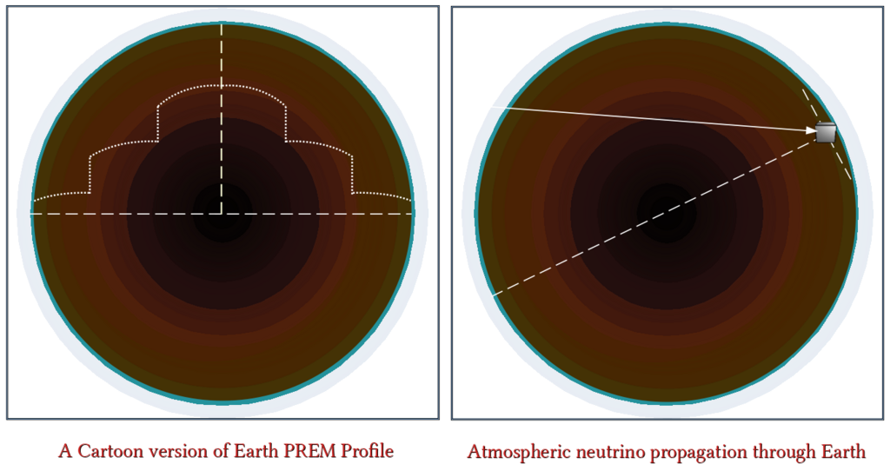

## PREM Source Profile Generator

It generates the "OscEarthPREMProfle.cxx" in "src" directory.

The PREM Profile Should Contain Increasing Order Of Layer-Radius!!!

Layer Radii Must be in KM Unit, and Densities Must be in g/cc Unit

<pre>
How To Use :
   chmod +x PREM.sh
   ./PREM.sh
   [Enter File Name]
   Done !!!

This Cartoon shows, how the neutrino propagates through the Earth's layers.
